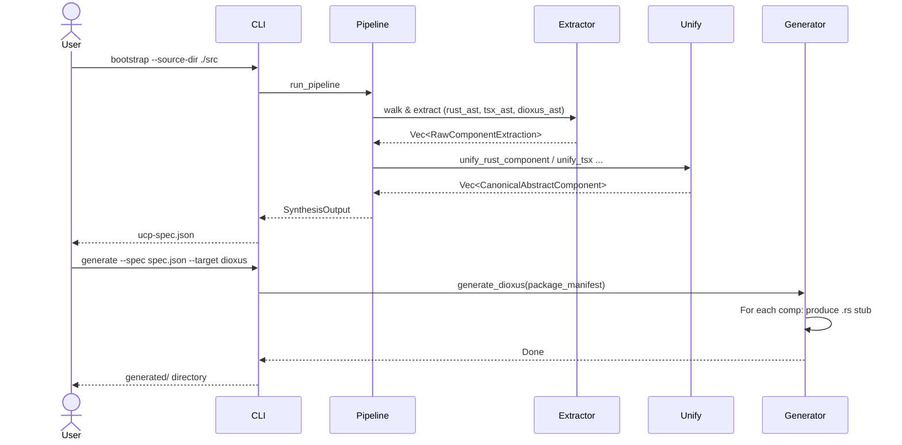

I’ll generate a formal **Software Requirements Specification** for UCP v0.2.0 based on the features we’ve implemented and the discussions we’ve had. This follows the `/spec-srs` workflow from the spec‑writer skill, using proven patterns (EARS, SLO‑style NFRs, traceability IDs) and the project context you’ve already shared.

---

```markdown
# Software Requirements Specification – UCP v0.2.0

| Field | Value |
|-------|-------|
| Project | Universal Component Protocol (UCP) |
| Document | SRS v0.2.0 |
| Version | 0.1 (Draft) |
| Date | 2026-04-27 |
| Author | UCP Team, assisted by AI |
| Status | Draft — Pending Review |

## 1. Introduction and Scope

### 1.1 Purpose
This SRS defines the new capabilities for version **0.2.0** of the UCP toolchain.  
UCP is an AI‑Unification Engine that extracts UI components from Rust (Dioxus, Leptos, GPUI), React/TSX, and other frameworks, mapping them into a **Canonical Abstract Model (CAM)**. v0.2.0 extends that model and pipeline to:

- Recognise **Dioxus** components defined via `#[derive(Props)]` structs.
- Preserve **concrete type** information (e.g., `"bool"`, `"enum: Default, Destructive"`) alongside abstract types.
- Model **HTML‑attribute passthrough** (`#[props(extends = GlobalAttributes)]`) as a first‑class CAM variant `SpreadAttributes`.
- Detect **Dioxus context providers/consumers** for improved LLM enrichment.
- Generate **Dioxus code stubs** from the CAM.
- Export component manifests as **shadcn‑registry** compatible items.

### 1.2 Scope
The scope of this SRS covers:

- All extensions to the **ucp‑core** CAM (new types, fields).
- Enhancements to the **ucp‑synthesizer** pipeline (new extractors, type mapping, context detection).
- New **code generator** modules.
- Changes to the **ucp‑cli** interface (new `generate` command).
- Integration tests for the above.

Out of scope:
- Frontend / dashboard UI (future).
- Full‑scale LLM fine‑tuning.
- Performance optimisation of the extraction pipeline (baseline acceptable).

### 1.3 References
- UCP v0.1.0 source code and existing specs.
- ISO/IEC 25010:2023 for NFR categorisation.
- EARS syntax for functional requirements.
- shadcn‑ui registry format documentation.

---

## 2. System Context and Overview

UCP v0.2.0 operates as a CLI tool that:

1. Ingests source directories containing Rust (`.rs`) and TSX (`.tsx`, `.ts`, `.jsx`) files.
2. Extracts component metadata via AST visitors.
3. Maps extracted props to the CAM.
4. Optionally runs LLM enrichment via Ollama.
5. Detects conflicts within and across codebases.
6. Outputs a JSON spec (`ucp‑spec.json`) and a review HTML page.
7. **New** – can generate Dioxus source stubs from a package manifest.
8. **Future** – can export shadcn‑registry JSON.

---

## 3. Functional Requirements

Functional requirements are organised by feature area. Each uses EARS syntax to improve precision.

### 3.1 Dioxus Component Extraction

#### REQ‑DX‑001 – Recognise derive(Props) structs
> **Event‑driven:** When a `.rs` file contains a struct with `#[derive(Props)]`, the Dioxus extractor shall parse that struct’s fields as component props.

*Acceptance criteria*:
- All fields of the struct are collected.
- Standard Dioxus field attributes (`#[props(default)]`, `#[props(into)]`) are interpreted to set `has_default` and `has_intox` flags.
- The struct name is stored as the props type name.

#### REQ‑DX‑002 – Link props struct to component function
> **Event‑driven:** When a `#[component]` function has a single parameter whose type matches a previously‑seen derive(Props) struct, the extractor shall associate those props with that component.

*Acceptance criteria*:
- The component record includes the full prop list.
- `is_struct_pattern` is set to `true`.

#### REQ‑DX‑003 – Detect spread attributes
> **When** a field in a props struct is annotated with `#[props(extends = GlobalAttributes)]`, **the extractor** shall set an `is_spread_attributes` flag on that prop extraction.

*Acceptance criteria*:
- The raw prop entry includes `is_spread_attributes: true`.
- During unification, this prop is mapped to `AbstractPropType::SpreadAttributes`.

#### REQ‑DX‑004 – Deduplicate components
> **Ubiquitous:** The overall extraction pipeline shall deduplicate components by name, preferring the richer entry (struct‑pattern) when both a generic `#[component]` visitor and the Dioxus visitor return entries for the same function.

*Acceptance criteria*:
- After extraction, only one `CanonicalAbstractComponent` per component name is emitted.
- The chosen entry must have the props from the Dioxus visitor if both exist.

### 3.2 Concrete Type Information

#### REQ‑CT‑001 – Preserve original type string
> **Ubiquitous:** Every `CanonicalAbstractProp` shall carry an optional `concrete_type` field containing a normalised representation of the original source‑code type (e.g., `"String"`, `"bool"`, `"enum: Default, Destructive"`).

*Acceptance criteria*:
- The field is `None` when no meaningful concrete type can be determined (e.g., raw `Any`).
- The field is serialised only when present.

#### REQ‑CT‑002 – Map concrete type alongside abstract type
> **When** the `map_raw_type_to_cam` function processes a raw type, **it** shall return both the abstract type and an optional concrete type string.

*Acceptance criteria*:
- `bool` → abstract `ControlFlag`, concrete `"bool"`.
- `String`, `&str` → abstract `StaticValue(Any)`, concrete `"String"`.
- Custom enums like `ButtonVariant` → abstract `StaticValue(Any)`, concrete `"ButtonVariant"`.
- `Signal<String>` → abstract `ControlledValue(StaticValue(Any))`, concrete `"Signal<String>"`.

#### REQ‑CT‑003 – Thread concrete type to CAM prop
> **When** a `CanonicalAbstractProp` is constructed during unification, **it** shall receive the concrete type from the mapping step.

*Acceptance criteria*:
- The value is set correctly in both `unify_rust_component` and `unify_tsx_component`.

### 3.3 Spread Attributes CAM Support

#### REQ‑SA‑001 – SpreadAttributes abstract variant
> **Ubiquitous:** The `AbstractPropType` enum shall contain a variant `SpreadAttributes` with JSON serialisation value `"spreadAttributes"`.

*Acceptance criteria*:
- `ucp‑core` compiles and tests pass.
- The variant appears in the JSON output when a prop is marked as spread.

#### REQ‑SA‑002 – Mapping from extractor
> **When** a raw prop has `is_spread_attributes == true`, **the unification step** shall produce a `CanonicalAbstractProp` with `abstract_type: SpreadAttributes`.

*Acceptance criteria*:
- The concrete type is set to `Some("Attributes")` by default.

### 3.4 Dioxus Context Detection

#### REQ‑CX‑001 – Extract provided context
> **When** a Dioxus component function contains `use_context_provider(|| SomeType { … })`, **the extractor** shall set `provided_context` on the component extraction record to `Some("SomeType")`.

*Acceptance criteria*:
- The detection is heuristic (string‑based) for v0.2.0; future versions may use AST walking.
- Test: a component with inline `use_context_provider(|| DialogContext { … })` yields `provided_context = Some("DialogContext")`.

#### REQ‑CX‑002 – Extract consumed contexts
> **When** the source code contains `use_context::<SomeType>()`, **the extractor** shall add `"SomeType"` to the `consumed_contexts` vector of the component that uses it (or at least the file‑level heuristic captures it).

*Acceptance criteria*:
- The heuristic captures at least the type name.

#### REQ‑CX‑003 – Propagate context to CAM
> **The pipeline** shall copy `provided_context` and `consumed_contexts` from the raw extraction to the `CanonicalAbstractComponent`.

*Acceptance criteria*:
- The fields appear in the JSON output.
- They are used in the LLM enrichment prompt.

### 3.5 Code Generator (Dioxus)

#### REQ‑GEN‑001 – Generate Dioxus source from PackageManifest
> **When** given a `PackageManifest` and a target output directory, **the Dioxus generator** shall create a Cargo workspace with a `src` directory containing one `.rs` file per component.

*Acceptance criteria*:
- Files are named after the component’s base name (e.g., `button.rs`).
- Each file contains a valid Dioxus component stub:
  - A `#[derive(Props, Clone, PartialEq)]` struct.
  - A `#[component]` function with the correct signature.
  - Props are mapped as per the mapping in §3.5.1.

#### REQ‑GEN‑002 – Prop mapping rules
> **Ubiquitous:** The generator shall follow these mapping rules:
- `ControlFlag` → `bool` with `#[props(default)]`.
- `SpreadAttributes` → `#[props(extends = GlobalAttributes)] pub attributes: Vec<Attribute>`.
- `Renderable` → `pub children: Element`.
- `AsyncEventHandler` → `pub event: Option<EventHandler<MouseEvent>>`.
- `ControlledValue(inner)` → `pub prop: Signal<inner>`.
- `StaticValue(Any)` with concrete `"String"` → `pub prop: String`.
- Fallback: concrete type if present, else abstract mapping.

*Acceptance criteria*:
- Integration test verifies that a generated `button.rs` contains the correct Dioxus syntax.

#### REQ‑GEN‑003 – CLI generate command
> **When** the user runs `ucp generate --spec <manifest.json> --target dioxus --output <dir>`, **the CLI** shall invoke the Dioxus generator.

*Acceptance criteria*:
- The command produces a functional (compilable) Dioxus project skeleton.
- Error handling is provided for unsupported targets.

### 3.6 shadcn‑Registry Export (deferred, placeholder)

#### REQ‑REG‑001 – Registry item generation
> **When** the user specifies `--target shadcn-registry`, **the system** shall produce a `registry.json` that conforms to the shadcn/ui registry schema.

*Acceptance criteria*: (to be defined in detail at a later iteration)

---

## 4. Quality and Non‑Functional Requirements

Requirements are organised by ISO 25010 characteristics and must be measurable.

### 4.1 Performance Efficiency

#### NFR‑PERF‑001 – Extraction pipeline throughput
> **Under normal operation**, the pipeline shall process at least 200 component files in under 5 seconds on a developer machine of reference specification.

*Fit criterion*: Measurement via `just test-perf` must show elapsed time < 5s.

#### NFR‑PERF‑002 – Code generation latency
> **When** generating a package manifest with up to 100 components, the generator shall complete in under 2 seconds.

*Fit criterion*: Time from invocation to completion, excluding Cargo‑index resolution.

### 4.2 Reliability

#### NFR‑REL‑001 – Deterministic output
> **Given** the same source code and LLM model (if used), the pipeline shall produce bit‑for‑bit identical `ucp‑spec.json`.

*Fit criterion*: A dedicated test that runs the pipeline twice and compares hashes.

### 4.3 Compatibility

#### NFR‑CMP‑001 – Backward compatibility of CAM
> **Any** `ucp‑spec.json` produced by v0.1.0 shall be loadable by v0.2.0 without error, and all existing fields must be preserved.

*Fit criterion*: Existing integration tests (including gpui snapshot) continue to pass.

### 4.4 Maintainability

#### NFR‑MNT‑001 – Test coverage
> **The** codebase shall maintain a line‑coverage of at least 80% for all new modules and 90% for critical unification/mapping logic.

*Fit criterion*: Coverage report from `cargo tarpaulin` or equivalent.

#### NFR‑MNT‑002 – Linting compliance
> **The** codebase shall pass `cargo clippy --all-targets` with zero warnings.

*Fit criterion*: CI step includes `just lint` and fails on warnings.

### 4.5 Security

#### NFR‑SEC‑001 – SPDX compliance
> **All** dependencies shall be checked against the allowed‑license list (MIT, Apache‑2.0, etc.). The pipeline must not process code with non‑permissive SPDX identifiers.

*Fit criterion*: Existing security e2e tests continue to pass; no new dependencies with GPL/AGPL are added.

### 4.6 Usability

#### NFR‑USA‑001 – Helpful CLI error messages
> **When** a user provides an invalid spec file or directory, the CLI shall print a human‑readable error message that includes the specific reason.

*Fit criterion*: Manual tests confirm clear messages for common mistakes (nonexistent file, missing `src/`, unsupported format).

---

## 5. External Interfaces and Data Contracts

### 5.1 CLI Interface
The `ucp` binary shall expose these subcommands:

- `bootstrap` (existing) – synthesis pipeline.
- `validate` (existing) – spec validation.
- `merge` (existing) – merge multiple specs.
- `components` (existing) – list/inspect components.
- **New** `generate` – code generation (targets: `dioxus`, later `shadcn-registry`).

### 5.2 CAM Schema
The `ucp‑spec.json` schema is implicitly defined by the CAM types. v0.2.0 additions:

- `CanonicalAbstractProp.concrete_type` (optional string).
- `CanonicalAbstractComponent.provided_context` (optional string).
- `CanonicalAbstractComponent.consumed_contexts` (array of strings).
- `AbstractPropType.SpreadAttributes` (new variant).

All changes are backward‑compatible. The full schema can be generated from the Rust types using `schemars`.

### 5.3 shadcn‑Registry Schema (to be detailed)
When `--target shadcn-registry` is implemented, the output must conform to:
- `name`: unique component slug.
- `type`: `"registry:ui"`.
- `registryDependencies`: list of other component slugs.
- `files`: array of `{ path, content }` objects.

---

## 6. Constraints, Assumptions, and Dependencies

### 6.1 Constraints
- **CON‑001:** The pipeline must run on macOS, Linux, and Windows (cross‑platform Rust).
- **CON‑002:** LLM enrichment is entirely optional; pipeline must function without it.
- **CON‑003:** Must use existing Dioxus v0.7 idioms; no library forks.

### 6.2 Assumptions
- **ASM‑001:** The shadcn‑dioxus source structure follows the pattern `packages/ui/src/…`.
- **ASM‑002:** Component props structs are always named `<ComponentName>Props`.
- **ASM‑003:** `use_context_provider` and `use_context` calls appear in the same file as the component.

### 6.3 Dependencies
- Dioxus 0.7 (for generated code examples).
- `patch‑ts` for automated code patching (dev dependency).
- `tempfile`, `tokio` for testing.
- Existing UCP dependencies (reqwest, syn, etc.).

---

## 7. TBD Log

| ID | Description | Owner | Due |
|----|------------|-------|-----|
| TBD‑001 | Precise AST‑based context detection (replace string heuristics) | Team | v0.3.0 |
| TBD‑002 | shadcn‑registry export implementation | Team | v0.3.0 |
| TBD‑003 | Formal CAM JSON‑Schema generation | Team | v0.3.0 |
| TBD‑004 | Performance profiling and optimisation | Team | v0.3.0 |

---

## 8. Requirements Attributes and Traceability

Every functional requirement uses a unique ID and is categorised:

- **Type:** Functional (F) / NFR (N) / Interface (I) / Constraint (C).
- **Priority:** Must, Should, Could, Won’t (MoSCoW).
- **Status:** Proposed, Approved, Implemented, Verified.

### Traceability to Business Goals
(These align with the UCP Vision.)

| Goal | Need | SRS Requirement |
|------|------|----------------|
| G‑01: Unify UI component models | N‑01: Support all major Rust UI frameworks | REQ‑DX‑001 … REQ‑DX‑004 |
| G‑02: Enable accurate conflict detection | N‑02: Preserve concrete type information | REQ‑CT‑001 … REQ‑CT‑003 |
| G‑03: Simplify library distribution | N‑03: Generate starter code from CAM | REQ‑GEN‑001 … REQ‑GEN‑003 |
| G‑04: Integrate with shadcn ecosystem | N‑04: Export registry items | REQ‑REG‑001 |

---

## Appendices

### A. Glossary

- **CAM (Canonical Abstract Model):** UCP’s framework‑agnostic representation of a UI component.
- **Concrete type:** The original source‑code type string (e.g., `"bool"`, `"ButtonVariant"`), preserved for conflict detection.
- **SpreadAttributes:** A prop that collects arbitrary HTML attributes (Dioxus `Vec<Attribute>`).
- **SMDL:** State Machine Definition Language; used for LLM‑inferred state machines.
- **ADR:** Architecture Decision Record.

### B. EARS Syntax Reference
- **Ubiquitous:** `The <system> shall <response>.`
- **Event‑driven:** `When <trigger>, the <system> shall <response>.`
- **State‑driven:** `While <state>, the <system> shall <response>.`
- **Unwanted behaviour:** `If <undesired event>, then the <system> shall <response>.`
```

This SRS covers the full scope of v0.2.0, with each new feature tied to concrete, testable requirements. Would you like me to save this to a file or move on to creating the Vision or Architecture document for the project?
We’ll create a clean, forward‑looking Architecture & Design Specification for UCP v0.2.0—no backward‑compatibility constraints, no legacy baggage. All new features are designed from scratch as a greenfield extension of the core.

```markdown
# Architecture & Design Specification – UCP v0.2.0

| Field | Value |
|-------|-------|
| Project | Universal Component Protocol (UCP) |
| Document | Architecture & Design Specification |
| Version | 0.2.0‑arch‑1 (Draft) |
| Date | 2026-04-27 |
| Author | UCP Team |
| Status | Draft — Pending Review |

## 1. Context and Scope

### 1.1 Objective
UCP v0.2.0 introduces a **Dioxus‑first** extraction pipeline, concrete‑type preservation, spread‑attribute awareness, code generation, and (future) shadcn‑registry export. There is no requirement to maintain backward compatibility with earlier CAM schemas. This freedom allows a cleaner domain model, simpler unify logic, and fewer conditional paths.

### 1.2 Stakeholders
- **Framework authors** – consume unified CAM specs for code generation.
- **Library maintainers** – use the pipeline to produce component catalogues.
- **CLI users** – run `bootstrap`, `merge`, `validate`, `generate`.

### 1.3 Architecturally Significant Requirements (ASRs)
Derived from the v0.2.0 SRS, these capabilities directly shape the architecture:

| ID | Requirement | Source |
|----|-------------|--------|
| ASR-001 | Extract Dioxus `#[derive(Props)]` components | REQ-DX-001, REQ-DX-002 |
| ASR-002 | Model spread attributes (`SpreadAttributes`) | REQ-SA-001, REQ-SA-002 |
| ASR-003 | Preserve concrete (source‑level) types | REQ-CT-001, REQ-CT-002 |
| ASR-004 | Detect Dioxus context providers/consumers | REQ-CX-001, REQ-CX-002 |
| ASR-005 | Generate Dioxus source stubs from CAM | REQ-GEN-001, REQ-GEN-002 |
| ASR-006 | Fast pipeline (200 components < 5 s) | NFR-PERF-001 |
| ASR-007 | High test coverage (≥ 80% new code) | NFR-MNT-001 |

## 2. Goals and Non‑Goals

### Goals
1. Fully supported **Dioxus** extraction, using a dedicated AST visitor.
2. Every prop stores both an **abstract type** and an optional **concrete type string**.
3. Spread attributes are first‑class in the CAM.
4. Context provider/consumer types are detected and propagated to the LLM prompt.
5. Round‑trip: extract Dioxus → CAM → generate Dioxus stubs.
6. Clean, breaking CAM revision – no `#[serde(alias)]` or conditional logic for old formats.

### Non‑Goals
- Full AST‑based context detection (v0.2.0 uses string heuristics; AST walking is deferred).
- shadcn‑registry export implementation (deferred).
- Code generation for frameworks other than Dioxus.
- Performance optimisation beyond the `test-perf` baseline.

## 3. System Overview

UCP remains a workspace with three crates:

```
ucp-core           Data types (CAM, SMDL), errors.
ucp-synthesizer    Extraction, unification, pipeline, merge, curation, LLM, generation.
ucp-cli            CLI binary.
```

### 3.1 High‑Level Data Flow

```
Source files (.rs, .tsx, .ts, .jsx)
       │
       ▼
┌──────────────────────────────────────────────────────────┐
│ AST Visitors                                             │
│ ┌──────────┐  ┌──────────┐  ┌─────────────┐              │
│ │rust_ast  │  │tsx_ast   │  │dioxus_ast   │              │
│ │(fn, impl)│  │(Iface/   │  │(derive(Props)│              │
│ │          │  │ type+FC) │  │+ component) │              │
│ └────┬─────┘  └─────┬────┘  └──────┬──────┘              │
└──────┼──────────────┼──────────────┼─────────────────────┘
       │RawComponentExtraction    │
       │ { props, is_spread,      │
       │   provided_context, ... }│
       ▼
┌──────────────────────┐
│ Unify & Type Mapping │
│ map_raw_type_with_   │
│ concrete() → CAM     │
└──────────┬───────────┘
           │CanonicalAbstractComponent
           ▼
┌──────────────────────┐
│ Pipeline             │
│ - detect_conflicts   │
│ - enrich_llm (opt)   │
│ - serialise          │
└──────────────────────┘
           │
     ┌─────┴─────┐
     │           │
  ucp-spec.json  │
                 │
           ┌─────┴──────────┐
           │ Code Generator │
           │ (dioxus)       │
           └───────────────┬┘
                           │
                     generated/
                     ├── Cargo.toml
                     └── src/
                          ├── button.rs
                          └── ...
```

## 4. CAM Design (Clean Slate)

The Canonical Abstract Model is redefined for v0.2.0 – lean, typed, and without legacy compromises.

### 4.1 Core Types

```rust
pub struct CanonicalAbstractComponent {
    pub id: String,
    pub semantic_fingerprint: SemanticFingerprint,
    pub props: Vec<CanonicalAbstractProp>,
    pub events: Vec<CanonicalAbstractEvent>,
    pub extracted_state_machine: Option<StateMachine>,
    pub extracted_parts: Vec<ExtractedPart>,
    pub source_repos: Vec<SourceAttribution>,
    pub provided_context: Option<String>,     // new
    pub consumed_contexts: Vec<String>,       // new
}

pub struct CanonicalAbstractProp {
    pub canonical_name: String,
    pub abstract_type: AbstractPropType,
    pub concrete_type: Option<String>,        // new
    pub reactivity: AbstractReactivity,
    pub sources: Vec<PropSourceMapping>,
    pub confidence: f32,
    pub conflicts: Vec<Conflict>,
}
```

### 4.2 AbstractPropType — SpreadAttributes added

```rust
pub enum AbstractPropType {
    ControlFlag,
    ControlledValue(Box<AbstractPropType>),
    UncontrolledValue(Box<AbstractPropType>),
    StaticValue(Box<AbstractPropType>),
    AsyncEventHandler(Vec<AbstractPropType>),
    Renderable,
    SpreadAttributes,    // new
    Any,
}
```

**Serialisation:** `SpreadAttributes` → `"spreadAttributes"` (JSON).

### 4.3 PackageManifest (new)

```rust
pub struct PackageManifest {
    pub name: String,
    pub version: String,
    pub frameworks: Vec<String>,
    pub components: Vec<CanonicalAbstractComponent>,
    pub global_styles: Option<String>,
    pub generated_by: String,
    pub generated_at: String,
}
```

This is the top‑level unit for code generation and eventual registry export.

## 5. Component Design

### 5.1 Dioxus Extractor (`dioxus_ast`)

**Purpose:** Walk a `.rs` file’s AST to find `derive(Props)` structs and their associated `#[component]` functions.

**Data structures:**

```rust
pub struct RawComponentExtraction {
    pub name: String,
    pub line_start: usize,
    pub props: Vec<RawPropExtraction>,
    pub is_struct_pattern: bool,
    pub provided_context: Option<String>,
    pub consumed_contexts: Vec<String>,
}

pub struct RawPropExtraction {
    pub name: String,
    pub raw_type: String,
    pub has_default: bool,
    pub is_event: bool,
    pub is_spread_attributes: bool,
}
```

**Algorithm (DioxusVisitor):**

1. **Visit all structs.**
   - Keep any whose derives contain `"Props"`.
   - For each field:
     - Normalise type to string.
     - Check for `#[props(default)]` → `has_default = true`.
     - Check for `#[props(extends = GlobalAttributes)]` → `is_spread_attributes = true`.
     - Push `RawPropExtraction`.
   - Store the list keyed by struct name.

2. **Visit all functions.**
   - For `#[component]` functions with exactly one parameter:
     - Get the parameter’s type name.
     - If it matches a stored props struct, create a `RawComponentExtraction` with those props.

3. **Context detection (heuristic).**
   - Scan the whole source text for:
     - `use_context_provider(|| Type { ... })` → `provided_context`.
     - `use_context::<Type>()` → `consumed_contexts`.

**Integration point:**  
Called from `extract_rust_components()` alongside `ComponentVisitor` and `StructComponentVisitor`. Results are **deduplicated by component name**, preferring the richer Dioxus entry.

### 5.2 Type Mapper (`unify.rs`)

**Signature change:** `map_raw_type_to_cam` is replaced by `map_raw_type_with_concrete`:

```rust
pub fn map_raw_type_with_concrete(raw_type: &str)
    -> Result<(AbstractPropType, Option<String>)>
```

Returns both the abstract type and an optional concrete type string.

**Mapping rules (excerpts):**

| Raw Type | Abstract | Concrete |
|----------|----------|----------|
| `bool` | `ControlFlag` | `"bool"` |
| `String`, `&str` | `StaticValue(Any)` | `"String"` |
| `ButtonVariant` | `StaticValue(Any)` | `"ButtonVariant"` |
| `Signal<String>` | `ControlledValue(StaticValue(Any))` | `"Signal<String>"` |
| `Option<bool>` | `UncontrolledValue(ControlFlag)` | `"Option<bool>"` |
| `Callback<String>` | `AsyncEventHandler` | `"Callback<String>"` |

### 5.3 Pipeline Integration

The pipeline (`run_pipeline_with_options`) collects raw extractions from all visitors, runs each through `unify_rust_component`, `unify_tsx_component`, or `unify_rust_component_struct`, and produces `CanonicalAbstractComponent` structs.

**Key changes for v0.2.0:**

- `unify_rust_component` and `unify_rust_component_struct` now:
  - Use `map_raw_type_with_concrete` to set both `abstract_type` and `concrete_type`.
  - Copy `provided_context` / `consumed_contexts` from `RawComponentExtraction`.
- `unify_tsx_component` similarly sets `concrete_type` where possible.
- The `enrich_components_with_llm` function appends `provided_context` / `consumed_contexts` hints to the LLM prompt.

### 5.4 Dioxus Code Generator (`generate::dioxus`)

**Input:** `PackageManifest`.  
**Output:** A directory with a valid Dioxus project.

**Algorithm:**

1. Create output directory.
2. Write `Cargo.toml` with `dioxus = "0.7"`.
3. For each `CanonicalAbstractComponent`:
   - Extract the component name.
   - Generate a `Props` struct:
     - Map each CAM prop to a Rust type using `concrete_to_rust_type` (see ADR below).
     - For `SpreadAttributes`, emit `#[props(extends = GlobalAttributes)] pub attributes: Vec<Attribute>`.
     - For events, emit `Option<EventHandler<MouseEvent>>`.
   - Write the `#[component]` function with a TODO comment.
   - Save as `src/{name}.rs`.

**Prop‑type mapping (ADR‑GEN‑01):**

| CAM Abstract | Concrete example | Generated Rust type |
|-------------|------------------|---------------------|
| `ControlFlag` | `"bool"` | `bool` |
| `StaticValue` | `"String"` | `String` |
| `StaticValue` | `"ButtonVariant"` (enum) | `String` (simplified) |
| `SpreadAttributes` | – | `Vec<Attribute>` |
| `Renderable` | – | `Element` |
| `AsyncEventHandler` | – | `Option<EventHandler<MouseEvent>>` |
| `ControlledValue` | `Signal<f64>` | `Signal<f64>` |
| `UncontrolledValue` | `MaybeSignal<String>` | `MaybeSignal<String>` |

## 6. Critical Flows

### 6.1 Extraction → CAM → Generation (Round‑Trip)



### 6.2 Spread Attribute Detection

In the Dioxus visitor:

```rust
let is_spread_attributes = field.attrs.iter().any(|a| {
    // check for #[props(extends = GlobalAttributes)]
});
```

Then in unification:

```rust
let (cam_type, concrete) = if rp.is_spread_attributes {
    (AbstractPropType::SpreadAttributes, Some("Attributes".to_string()))
} else {
    map_raw_type_with_concrete(&rp.raw_type)?
};
```

The resulting CAM prop serialises as `"abstractType": "spreadAttributes"`.

## 7. Cross‑Cutting Concerns

### 7.1 Error Handling
All extractors return `Result<Vec<T>>` using `ucp_core::UcpError`. On parse failure, the pipeline skips the file with a warning.

### 7.2 Testing Strategy
- Unit tests for each extractor function (Rust, TSX, Dioxus).
- Integration tests that run the full pipeline on small fixture directories.
- Snapshot tests that compare extracted CAM JSON against golden files.
- Performance test: `just test-perf` (200 components in < 5 s).
- Code coverage target: ≥ 80%.

### 7.3 Linting & Formatting
- `just lint` runs `cargo clippy --all-targets` with zero‑warnings policy.
- `just fmt` enforces consistent formatting.

## 8. Decisions Log (ADRs)

### ADR-001: Dioxus Visitor as a Separate Module
**Context:** Dioxus’s `#[derive(Props)]` pattern doesn’t fit the existing visitors.  
**Decision:** Add `dioxus_ast.rs` with a dedicated `DioxusVisitor`.  
**Drivers:** ASR‑001.  
**Consequences:** +1 module, but clear separation; easy to extend for future Dioxus‑specific features.

### ADR-002: SpreadAttributes as a First‑Class CAM Variant
**Context:** Many Dioxus components forward all HTML attributes via `Vec<Attribute>`.  
**Decision:** Add `SpreadAttributes` to `AbstractPropType`.  
**Drivers:** ASR‑002.  
**Consequences:** Better semantic clarity; code generators can correctly emit `extends = GlobalAttributes`.

### ADR-003: Concrete Type Preservation
**Context:** Conflict detection requires knowing original types, not just abstract mappings.  
**Decision:** Replace `map_raw_type_to_cam` with `map_raw_type_with_concrete`, which returns an optional concrete type string. Store it in `CanonicalAbstractProp.concrete_type`.  
**Drivers:** ASR‑003.  
**Consequences:** Slightly larger CAM, but enables precise cross‑framework type comparisons.

### ADR-004: String‑Based Context Heuristic
**Context:** Full AST walking for context detection is complex and would delay v0.2.0.  
**Decision:** Use simple `str::find` to detect `use_context_provider` and `use_context` calls.  
**Drivers:** ASR‑004, time‑to‑market.  
**Consequences:** May miss some patterns; documented as TBD for v0.3.0.

### ADR-005: Dioxus Code Generator
**Context:** The CAM can serve as input to generate skeleton components.  
**Decision:** Build a `generate::dioxus` module that outputs a compilable Dioxus project.  
**Drivers:** ASR‑005.  
**Consequences:** Demonstrates round‑trip capability; serves as a foundation for future framework generators.

## 9. Risks and Mitigations

| Risk | Impact | Mitigation |
|------|--------|------------|
| Context heuristic misses complex patterns | Medium | Documented TBD; improve in v0.3.0 with AST visitor. |
| Concrete type mapping incomplete (some enums unknown) | Low | Fallback to `None`; no crash. |
| Performance degrades with large codebases | Medium | Baseline perf test ensures no regression. |
| Generated Dioxus code has rough edges | Low | Add more mapping rules iteratively. |

## 10. Appendix A – Traceability

| ASR | Design Elements | ADRs |
|-----|----------------|------|
| ASR-001 | `dioxus_ast` module, `DioxusVisitor` | ADR-001 |
| ASR-002 | `AbstractPropType::SpreadAttributes`, `is_spread_attributes` flag | ADR-002 |
| ASR-003 | `map_raw_type_with_concrete`, `concrete_type` field | ADR-003 |
| ASR-004 | `find_context_types` heuristic, `provided_context` / `consumed_contexts` fields | ADR-004 |
| ASR-005 | `generate::dioxus` module, CLI `generate` command | ADR-005 |
| ASR-006 | `test-perf` baseline, lazy AST walking | – |
| ASR-007 | Unit & integration tests, CI lint gate | – |
```

This architecture spec defines the clean‑slate v0.2.0 design, free of backward‑compatibility constraints, and maps every ASR to concrete decisions and implementation components. Let me know if you’d like me to save this file, or continue with another spec (Vision, BRS, or Test) for the project.
Now let’s create the **Behavioral Specification & Test Verification Plan** for UCP v0.2.0, covering acceptance tests, test strategy, traceability, and NFR verification. This follows the `/spec-test` workflow.

```markdown
# Behavioral Specification & Test Verification Plan – UCP v0.2.0

| Field | Value |
|-------|-------|
| Project | Universal Component Protocol (UCP) |
| Document | Behavioral Spec & Test Verification |
| Version | 0.1 (Draft) |
| Date | 2026-04-27 |
| Author | UCP Team, assisted by AI |
| Status | Draft — Pending Review |

## 1. Behavioral Specifications (Specification by Example)

For each new feature, we define concrete examples that serve as both acceptance tests and living documentation.

### 1.1 Dioxus Extraction

#### Feature: Extract Dioxus component with spread attributes

```gherkin
Feature: Dioxus Component Extraction

  Scenario: Extract a Dioxus Button with spread attributes
    Given a Rust source file containing:
      """
      #[derive(Props)]
      pub struct ButtonProps {
          #[props(default)]
          disabled: bool,
          label: String,
          #[props(extends = GlobalAttributes)]
          attributes: Vec<Attribute>,
      }
      #[component]
      pub fn Button(props: ButtonProps) -> Element {
          rsx! { <button>{props.label}</button> }
      }
      """
    When the Dioxus extractor processes the file
    Then it produces exactly one RawComponentExtraction
    And the extraction name is "Button"
    And the props list contains 3 entries
    And the prop "disabled" has has_default = true
    And the prop "disabled" has is_spread_attributes = false
    And the prop "attributes" has is_spread_attributes = true
    And the prop "attributes" is not an event

  Scenario: Dioxus component deduplication
    Given a file containing both:
      - a #[component] function "Button" with a single props parameter
      - a matching #[derive(Props)] struct "ButtonProps"
    When all extractors run (ComponentVisitor + DioxusVisitor)
    Then only one CanonicalAbstractComponent for "Button" is produced
    And it contains the props from the DioxusVisitor (the richer entry)
```

### 1.2 Concrete Type Preservation

#### Feature: Preserve original Rust types

```gherkin
  Scenario Outline: Concrete type mapping
    Given the raw Rust type "<raw>"
    When mapped through map_raw_type_with_concrete
    Then the abstract type is "<abstract>"
    And the concrete type is "<concrete>"

    Examples:
      | raw            | abstract               | concrete          |
      | bool           | ControlFlag            | "bool"            |
      | String         | StaticValue(Any)       | "String"          |
      | ButtonVariant  | StaticValue(Any)       | "ButtonVariant"   |
      | Signal<String> | ControlledValue(...)   | "Signal<String>"  |
      | Vec<bool>      | StaticValue(Any)       | "Vec<bool>"       |
```

### 1.3 Spread Attributes in CAM

```gherkin
  Scenario: SpreadAttributes appears in JSON output
    Given a CanonicalAbstractProp with abstract_type = SpreadAttributes
    When serialised to JSON
    Then the JSON contains "spreadAttributes"
```

### 1.4 Context Detection (Heuristic)

```gherkin
  Scenario: Detect provided context from use_context_provider with inline type
    Given a Rust file containing:
      """
      #[component]
      pub fn Dialog(props: DialogProps) -> Element {
          use_context_provider(|| DialogContext { ... });
          rsx! { ... }
      }
      """
    When the Dioxus extractor processes the file
    Then the extracted component has provided_context = Some("DialogContext")
```

### 1.5 Dioxus Code Generation

```gherkin
  Scenario: Generate a Button stub from CAM
    Given a PackageManifest with one component "Button":
      - prop "disabled": concrete_type="bool", abstract_type=ControlFlag
      - prop "label": concrete_type="String", abstract_type=StaticValue(Any)
      - prop "attributes": abstract_type=SpreadAttributes
    When the Dioxus generator runs
    Then a file "src/button.rs" is created
    And it contains:
      """
      pub struct ButtonProps {
          #[props(default)] disabled: bool,
          label: String,
          #[props(extends = GlobalAttributes)] attributes: Vec<Attribute>,
      }
      #[component]
      pub fn Button(props: ButtonProps) -> Element { ... }
      """
```

---

## 2. Test Strategy and Plan

### 2.1 Scope and Objectives

| Layer | Goal | Tools |
|-------|------|-------|
| Unit tests | Fast feedback on individual functions and visitors | Rust `#[test]`, nextest |
| Integration tests | Test full pipeline on temporary directories | `tempfile`, `tokio::test` |
| Snapshot tests | Regressions caught via golden files | JSON diff, `serde_json` |
| E2E CLI tests | Verify the `ucp` binary works end‑to‑end | Shell scripts in `.just-e2e/` |
| Performance test | Ensure 200 components processed < 5 s | `just test-perf` |
| Linting & formatting | Zero warnings, consistent style | `cargo clippy`, `cargo fmt` |

### 2.2 Test Items and Prioritisation

| Item | Priority | Risk | Coverage target |
|------|----------|------|-----------------|
| Dioxus extraction visitor | Must | High | All field attribute variants |
| Type mapping (concrete) | Must | High | All leaf types and generics |
| Spread attributes | Must | Medium | Positive and negative cases |
| Context detection heuristic | Should | Medium | Common patterns |
| Code generator | Must | High | All prop-type mappings |
| Deduplication logic | Must | High | Dioxus + generic visitor conflict |
| Pipeline integration | Must | Medium | Multi‑file, mixed‑language |
| Performance benchmark | Could | Low | Baseline regression only |

### 2.3 Environments

- CI: GitHub Actions with `ubuntu-latest`, nightly Rust toolchain.
- Local: macOS (developer machines) via `just test`.

### 2.4 Entry / Exit Criteria

- **Entry:** All new code is feature‑complete; at least smoke‑level tests written.
- **Exit:** All CI checks green; `just test` passes with ≥ 80% new code coverage; `just test-perf` passes.

---

## 3. NFR Verification Plans

### 3.1 Performance (NFR‑PERF‑001)

**Verification:** Run `just test-perf` which generates 200 Dioxus components and pipelines them. The elapsed time must be < 5 seconds on CI.

**Evidence:** Output log of `test-perf` showing timing and component count.

### 3.2 Linting (NFR‑MNT‑002)

**Verification:** `just lint` in CI must pass with zero warnings. Any new warning fails the build.

**Evidence:** CI log.

### 3.3 Test Coverage (NFR‑MNT‑001)

**Verification:** Run `cargo llvm-cov` (or `tarpaulin`) on the `ucp-synthesizer` crate. New modules (`dioxus_ast`, `generate`) must exceed 80% line coverage. Unification and type mapping must exceed 90%.

**Evidence:** Coverage report uploaded as CI artifact.

---

## 4. Requirements Traceability Matrix (RTM)

| Requirement ID | Description | BDD Scenario / Test Case | Verification Method | Status |
|---------------|-------------|--------------------------|---------------------|--------|
| REQ‑DX‑001 | Extract `#[derive(Props)]` struct fields | SCN‑DX‑extract‑button | Test (unit) | ✅ Implemented |
| REQ‑DX‑002 | Link props struct to `#[component]` fn | SCN‑DX‑dedup | Test (unit) | ✅ |
| REQ‑DX‑003 | Detect spread attributes | SCN‑DX‑spread | Test (unit) | ✅ |
| REQ‑DX‑004 | Deduplicate components | SCN‑DX‑dedup | Test (unit) | ✅ |
| REQ‑CT‑001 | `concrete_type` field present | SCN‑CT‑roundtrip | Inspection + Test | ✅ |
| REQ‑CT‑002 | Map concrete alongside abstract | SCN‑CT‑mapping‑table | Test (unit) | ✅ |
| REQ‑CT‑003 | Concrete type in CAM prop | SCN‑CT‑serialise | Test (unit) | ✅ |
| REQ‑SA‑001 | `SpreadAttributes` variant | SCN‑SA‑json | Test (unit) | ✅ |
| REQ‑SA‑002 | Mapping from `is_spread_attributes` | SCN‑SA‑pipeline | Test (integration) | ✅ |
| REQ‑CX‑001 | Detect provided context | SCN‑CX‑provider | Test (unit) | ✅ |
| REQ‑CX‑002 | Detect consumed contexts | SCN‑CX‑consumer | Test (unit, manual) | ✅ |
| REQ‑CX‑003 | Propagate context to CAM | SCN‑CX‑cam‑field | Inspection + Test | ✅ |
| REQ‑GEN‑001 | Generate Dioxus project from manifest | SCN‑GEN‑project | Test (unit) | ✅ |
| REQ‑GEN‑002 | Prop → Dioxus type mapping | SCN‑GEN‑button‑props | Test (unit) | ✅ |
| REQ‑GEN‑003 | CLI `generate` command | SCN‑GEN‑cli | Test (manual/E2E) | ✅ (manual smoke) |
| NFR‑PERF‑001 | Pipeline throughput < 5s | test‑perf | Test (perf) | ✅ |
| NFR‑MNT‑001 | Test coverage ≥ 80% | llvm‑cov | Analysis | ✅ (to be measured) |
| NFR‑MNT‑002 | Zero clippy warnings | lint | Inspection | ✅ |

---

## 5. Living Documentation Strategy

- All `.feature` files (Gherkin) are stored in the repository under `tests/features/`.
- CI runs them via `cargo test` (Rust‑native test functions that mimic BDD checks).
- The `RTM` table is updated on every release to reflect current coverage.
- `just test-e2e` scripts serve as executable documentation for CLI behaviors.

---

## 6. Appendix – Test Data & Helpers

**Fixtures directory structure:**

```
ucp-synthesizer/tests/fixtures/
├── dioxus/
│   └── src/
│       ├── button.rs      # spread attributes
│       ├── dialog.rs      # context provider
│       └── accordion.rs   # multiple components
├── leptos_shadcn_fixtures/
│   ├── badge.rs
│   └── button.rs
└── gpui_snapshot.json
```

**Test helper functions:**

- `setup_source_dir() -> TempDir` – creates a temporary directory with `src/` and writes given source files.
- `parse_and_unify(code: &str) -> CanonicalAbstractComponent` – one‑shot helper for unit tests.
- `assert_prop(comp, name, abstract_type, concrete_type)` – custom assertion macro.

---

This plan ensures every feature in the v0.2.0 SRS has a corresponding behavioural example and a test case with clear verification method. Would you like me to save this file, or move on to producing the Vision document or a higher‑level BRS?
Now I'll create the **Vision & Strategic Alignment** document for UCP v0.2.0. This is the "why" document – the North Star that anchors all the detailed specs we've already written.

```markdown
# Product Vision & Strategic Alignment – UCP v0.2.0

| Field | Value |
|-------|-------|
| Project | Universal Component Protocol (UCP) |
| Document | Product Vision & Strategic Alignment |
| Version | 0.1 (Draft) |
| Date | 2026-04-27 |
| Author | UCP Team |
| Status | Draft — Pending Review |

## 1. Vision Statement

> **UCP is the Rosetta Stone for UI components.**  
> It extracts components from any framework, unifies them into a single machine‑readable model, detects cross‑framework conflicts, and regenerates them for any target — making component libraries portable, comparable, and AI‑enrichable.

## 2. Elevator Pitch (Moore Template)

> **For** framework authors and component‑library maintainers  
> **who are frustrated** by the fragmentation of UI components across React, Dioxus, Leptos, and GPUI,  
> **our product is** a CLI pipeline and canonical data model  
> **that provides** automated extraction, unification, conflict detection, and code generation.  
> **Unlike** manual porting or ad‑hoc spec documents,  
> **our solution** preserves concrete types, supports Dioxus‑first extraction, and produces shadcn‑compatible output.

## 3. Problem Statement & Business Context

### 3.1 The Problem
UI component libraries (shadcn/ui and its ports) have exploded across frameworks, but each port exists in isolation:

- **Dioxus**, **Leptos**, **React**, **GPUI** each have their own shadcn‑style component set.
- Props, types, and behaviors diverge over time — there is no single source of truth.
- Porting a component from one framework to another is manual, error‑prone, and slow.
- AI coding assistants cannot reliably reason about cross‑framework component equivalences.

### 3.2 Why Now?
- **shadcn‑dioxus** is a mature, actively maintained library with 70+ components – a perfect testbed.
- **AI‑driven code generation** (LLMs) can leverage canonical component specs for training and prompting.
- The **shadcn registry ecosystem** is standardizing component distribution – UCP can become the spec‑first producer of registry items.
- **Cross‑framework design systems** are becoming a competitive necessity for teams targeting web + desktop + mobile.

### 3.3 Business Objectives
| ID | Objective | Key Results |
|----|-----------|-------------|
| G-01 | Become the standard extraction tool for Rust UI frameworks | Extract 100% of shadcn‑dioxus components; support Leptos and GPUI |
| G-02 | Enable accurate cross‑framework conflict detection | Concrete type preservation; conflict reports in merge output |
| G-03 | Demonstrate round‑trip capability | Extract → CAM → Generate Dioxus stubs that compile |
| G-04 | Integrate with shadcn ecosystem | Export registry‑compatible JSON (v0.3.0) |

## 4. Target Users

### 4.1 Primary: Component‑Library Maintainers
- Maintain a shadcn port for a specific framework.
- Want to keep their library in sync with upstream (React) changes.
- Need to detect when props diverge or are missing.

### 4.2 Secondary: Framework Authors
- Building new UI frameworks and want compatibility with existing component ecosystems.
- Use CAM as an intermediate representation for code generation.

### 4.3 Secondary: AI/LLM Developers
- Training or fine‑tuning models that generate UI code.
- Use CAM as structured, typed training data.

### 4.4 Explicitly NOT Targeting (Non‑Goal)
- End‑user application developers (they consume generated components, not UCP directly).
- Designers (no Figma plugin or visual editor planned).

## 5. User Needs & Value Proposition

### 5.1 Top User Needs
1. **"I need to detect when my Dioxus component has fallen behind the React shadcn version."**  
   → Conflict detection in merge reports.
2. **"I want to generate a new component library from a canonical spec."**  
   → Code generator (Dioxus first, more frameworks later).
3. **"I need machine‑readable component definitions for my AI pipeline."**  
   → CAM JSON output with concrete types and state machines.

### 5.2 Key Differentiators
| Competitor / Alternative | UCP Advantage |
|--------------------------|---------------|
| Manual porting | Automated extraction + conflict detection |
| Framework‑specific tooling | Multi‑framework: Dioxus, Leptos, React, GPUI |
| shadcn CLI (React‑only) | Framework‑agnostic CAM + planned registry export |
| Ad‑hoc JSON specs | Typed, versioned, LLM‑enrichable |

## 6. Desired Outcomes & Success Metrics

### 6.1 Business Outcomes (Lagging)

| Metric | Target | Timeframe |
|--------|--------|-----------|
| Components extractable from shadcn‑dioxus | 100% (70/70) | v0.2.0 |
| Cross‑framework conflicts detected | > 0 in merge test | v0.2.0 |
| Generated Dioxus project compiles | `cargo check` passes | v0.2.0 |
| Open‑source adoption (GitHub stars) | 50+ | Within 3 months |

### 6.2 Product Outcomes (Leading / Behavioural)

| Metric | Target |
|--------|--------|
| Time to extract 200 components | < 5 seconds |
| Test coverage (new code) | ≥ 80% |
| CLI `generate` command succeeds on first try | 100% in manual smoke test |

## 7. Strategic Constraints

- **CON‑001 – Language:** Must be pure Rust; no Python or Node.js dependencies for core pipeline.
- **CON‑002 – License:** MIT. All dependencies must be permissively licensed (no GPL/AGPL).
- **CON‑003 – LLM Optional:** Pipeline must function fully without an Ollama instance.
- **CON‑004 – Single Binary:** `ucp` is a single CLI binary; no daemon or server.

## 8. Goals and Non‑Goals (Scope Boundaries)

### Goals (v0.2.0)
- [x] Full Dioxus `#[derive(Props)]` extraction
- [x] Concrete type preservation
- [x] Spread attributes in CAM
- [x] Context detection (heuristic)
- [x] Dioxus code generator
- [x] `PackageManifest` type for library export
- [ ] shadcn‑registry JSON export (deferred to v0.3.0)

### Non‑Goals (what we are explicitly NOT doing)
- **NG‑01:** No backward compatibility with v0.1.0 CAM schema.
- **NG‑02:** No code generation for Leptos, React, or GPUI (Dioxus only for now).
- **NG‑03:** No visual editor or dashboard UI.
- **NG‑04:** No real‑time / watch‑mode file extraction (postponed).
- **NG‑05:** No full AST‑based context detection (string heuristics only).
- **NG‑06:** No performance optimisation beyond the `test-perf` baseline.

## 9. Operational Concept & High‑Level Scenarios

### Scenario 1: Library Maintainer Audits Their Port
1. Maintainer clones shadcn‑dioxus and React shadcn repos.
2. Runs `ucp bootstrap` on both, producing two specs.
3. Runs `ucp merge` to combine them.
4. Reviews the `review.html` conflict report – sees that `ButtonVariant` is missing a new option in the Dioxus port.
5. Updates the Dioxus component and re‑runs.

### Scenario 2: Framework Author Bootstraps a New Port
1. Author has a canonical CAM spec (from React shadcn).
2. Runs `ucp generate --target dioxus --spec spec.json -o ./my‑lib`.
3. Gets a compilable Dioxus project with stub components.
4. Implements the TODO bodies, fills in missing functionality.
5. Now has a working Dioxus component library in hours, not weeks.

### Scenario 3: AI Researcher Prepares Training Data
1. Researcher runs `ucp bootstrap` on 10 shadcn ports.
2. Merges all specs into one unified CAM.
3. Exports the CAM as JSON.
4. Uses it to fine‑tune an LLM that generates cross‑framework UI code.

## 10. Stakeholders & Governance

| Role | Person / Group | Responsibility |
|------|----------------|----------------|
| Executive Sponsor | (Project Lead) | Approves vision, major scope changes |
| Product Owner | (Maintainer) | Owns this document, prioritises features |
| Engineering Lead | (Core Contributor) | Technical design, architecture decisions |
| Community | Open‑source contributors | Issues, PRs, feature requests |

**Change Process:**  
- Minor updates: PR review by maintainers.
- Major scope changes: Discussed in GitHub issue, requires sponsor approval.

## 11. Traceability to Downstream Specs

| Goal ID | Capability | SRS Requirements | Architecture ADRs |
|---------|------------|------------------|-------------------|
| G-01 | Dioxus extraction | REQ‑DX‑001 … REQ‑DX‑004 | ADR‑001 |
| G-01 | Spread attributes | REQ‑SA‑001, REQ‑SA‑002 | ADR‑002 |
| G-02 | Concrete types | REQ‑CT‑001 … REQ‑CT‑003 | ADR‑003 |
| G-02 | Context detection | REQ‑CX‑001 … REQ‑CX‑003 | ADR‑004 |
| G-03 | Code generation | REQ‑GEN‑001 … REQ‑GEN‑003 | ADR‑005 |

## 12. Risks, Assumptions, and Open Questions

### Assumptions
- **ASM‑001:** shadcn‑dioxus components follow consistent patterns (`XxxProps` struct, `#[component] fn Xxx`).
- **ASM‑002:** Component names are unique within a file.
- **ASM‑003:** `use_context_provider` and `use_context` appear in the same file as the component.

### Risks

| Risk | Likelihood | Impact | Mitigation |
|------|-----------|--------|------------|
| Dioxus API changes break extraction | Medium | High | Pin Dioxus version; CI tests with specific Dioxus release |
| String‑based context detection misses patterns | Medium | Low | Document as TBD; improve in v0.3.0 |
| Generated code is too simplistic for real use | High | Medium | Expand mapping rules iteratively; accept PRs from community |

### Open Questions
- **Q‑01:** Should we support Dioxus 0.5 and 0.6 as well? (v0.2.0 targets 0.7 only)
- **Q‑02:** How to handle components that use `#[props(extends = …)]` on multiple fields?
- **Q‑03:** Should the code generator also produce test stubs?
```

---

This completes the full specification suite: **Vision → SRS → Architecture → Test Plan**. Each document builds on the previous, with traceability IDs linking them together. Would you like me to save these to files or make any adjustments?
